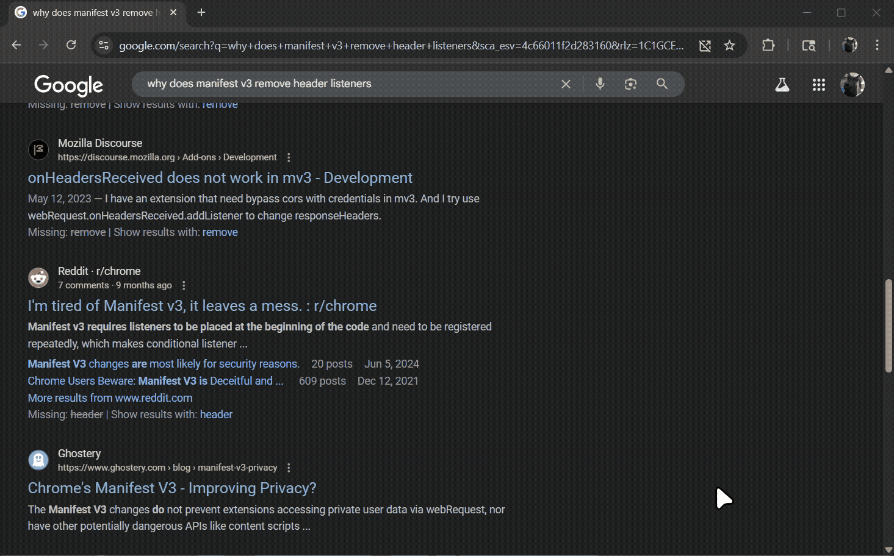

# Link Previewer ✨ 

[](https://github.com/your-username/link-previewer)
[](https://github.com/your-username/link-previewer)
[](https://opensource.org/licenses/GPL)

Tired of endlessly switching tabs just to see what's behind a link?<br>
**Link Previewer** lets you peek into web pages without ever leaving your current tab. Enjoy an uncluttered browsing experience and an uninterrupted workflow!

<br>
 
<br>


## 🚀 Key Features

* **Seamless Previews**: Open links in a sleek, floating pop-up window.
* **Intuitive Controls**:
    * **Long-press** a link to open a preview.
    * **Modifier Key + Click** (e.g., `Shift + Click`) for an instant preview.
* **Fully Customizable Window**: Drag to move and resize the preview window to fit your workflow perfectly. Your size and position are saved automatically!
* **Personalized Experience**: Use the settings panel to change the long-press duration, modifier keys, default window size, and more.
* **Light & Dark Modes**: A beautiful interface that adapts to your system's theme or your personal preference.
* **Cross-Browser Support**: Works flawlessly on both **Google Chrome** and **Mozilla Firefox**.


## 💡 How to Use

Using Link Previewer is incredibly simple:

1.  **Long Press**: Just hold your mouse down on any link for a moment. A preview window will gracefully appear.
2.  **Modifier + Click**: For even faster access, hold down your chosen modifier key (Shift by default) and click any link.

The preview window can be moved by dragging its header and resized by dragging its edges. To close it, simply click the 'x' button, press your configured close key (`Escape` by default), or click anywhere outside the window.

### ⚙️ Customization

Toggle light/dark mode, set click duration and more! Click the Link Previewer icon in your browser's toolbar to open the settings panel.
<br>
 
<br>

## ✅ Compatibility
Works with Manifest V3 and Chrome!
<br>
 
<br>

## 🛠️ Building From Source

Want to contribute or build your own version? Follow these simple steps.

### Prerequisites

* [Node.js](https://nodejs.org/) (which includes npm) installed on your system.
* Linux-compliant system for bulding, though it is not hard to adapt the build commands for BSD or Windows

### Steps

1.  **Clone the Repository**
    ```bash
    git clone https://github.com/Adam-Yung/link-previewer.git
    cd link-previewer
    ```

2.  **Build the Extension**
    You can build for Chrome or Firefox using the following npm scripts:

    * **For Google Chrome:**
        ```bash
        npm run build:chrome
        ```
    * **For Mozilla Firefox:**
        ```bash
        npm run build:firefox
        ```
    After running a build command, the complete, unpacked extension will be available in the `dist/` directory.

3.  **Load the Extension in Your Browser**

    * **Chrome:**
        1.  Navigate to `chrome://extensions`.
        2.  Enable "Developer mode" (toggle in the top right).
        3.  Click "Load unpacked".
        4.  Select the `dist` folder from this project.

    * **Firefox:**
        1.  Navigate to `about:debugging`.
        2.  Click "This Firefox" in the sidebar.
        3.  Click "Load Temporary Add-on...".
        4.  Open the `dist` folder and select the `manifest.json` file.

---

## 🤝 Contributing

Contributions, issues, and feature requests are welcome! Feel free to check the [issues page](https://github.com/your-username/link-previewer/issues).

## 📜 License

This project is licensed under the GPL-3.0 License - see the [LICENSE.md](LICENSE.md) file for details.

